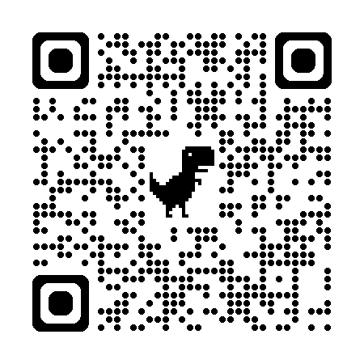

# Portfolio Personal — Diana Duta


> **"Del pensamiento abstracto a la arquitectura de software."** > Un espacio digital diseñado para mostrar mi trayectoria desde la Filosofía de la Lógica hacia el Desarrollo Backend y la arquitectura de datos.

--------------------------------------------------------

## Sobre el Proyecto

Este repositorio contiene el código fuente de mi portafolio personal. Además de ser una galería de proyectos, esta aplicación ha sido construida para darme a conocer en este campo.

La aplicación es una SPA (Single Page Application) construida con **React + Vite**, enfocada en el rendimiento, la accesibilidad y una estética cuidada bajo el concepto *"Lavender & Slate"* .

Visita el portfolio:
https://dianaduta.github.io/portfolio-diana/

O escanea este código QR con la cámara del móvil para acceder al portfolio:

<p align="center">
  
</p>

### Características Principales

*** Diseño Glassmorphism:** Implementación manual de efectos de cristal esmerilado (`backdrop-filter`) sin librerías externas de UI.
*** Rendimiento Óptimo:** Uso de **Vite** para un empaquetado ultrarrápido y carga diferida de assets.
*** Diseño Responsive:** Grid Layouts adaptativos que cambian de columnas simples a complejas (Bento Grid) según el dispositivo.
*** Arquitectura Modular:** Uso estricto de **CSS Modules** para evitar colisiones de estilos y mantener el código mantenible.
***Separación de Intereses (SoC):** Los datos (textos, proyectos) están completamente desacoplados de la lógica visual (`data/content.js`), permitiendo actualizaciones sin tocar componentes.
*** Micro-interacciones:** Animaciones fluidas al hacer scroll utilizando un Hook personalizado (`IntersectionObserver`).

-----------------------------------------------------------

## Stack Tecnológico

La aplicación ha sido desarrollada utilizando las siguientes tecnologías y herramientas:

| Categoría | Tecnologías |
| :--- | :--- |
| **Core** | React 18, JavaScript (ES6+) |
| **Build Tool** | Vite |
| **Estilos** | CSS3, CSS Modules, Variables CSS (Custom Properties) |
| **Hooks** | `useState`, `useEffect`, `useMemo`, `useRef`, Custom Hooks |
| **Fuentes** | Inter (Cuerpo), Playfair Display (Títulos) |

-----------------------------------------------------------

## Estructura del Proyecto

El código está organizado siguiendo principios de limpieza y escalabilidad:

```bash

src/
├── components/            # Biblioteca de componentes UI
│   ├── CodeBlock.jsx      # Simulación visual de editor de código (decorativo)
│   ├── CodeBlock.module.css
│   ├── FadeIn.jsx         # HOC (Higher-Order Component) para animaciones al hacer scroll
│   ├── NavBar.jsx         # Navegación 'Sticky' con lógica de IntersectionObserver
│   ├── NavBar.module.css
│   ├── ProjectCard.jsx    # Tarjeta de proyecto con efectos Glassmorphism y 3D hover
│   ├── ProjectCard.module.css
│   ├── Section.jsx        # Wrapper semántico para estandarizar márgenes y títulos
│   ├── Section.module.css
│   ├── SkillPill.jsx      # Componente tipo 'chip' para listar tecnologías
│   └── SkillPill.module.css
├── data/
│   └── content.js         # "Single Source of Truth". Centraliza textos, proyectos y datos.
├── App.jsx                # Orquestador principal. Define la estructura del Layout.
├── App.module.css         # Estilos del Layout principal (Grids, Hero, Fondos).
├── index.css              # Reset CSS, Fuentes, Variables globales (:root) y keyframes.
└── main.jsx               # Punto de entrada (Entry Point) y montaje de React.